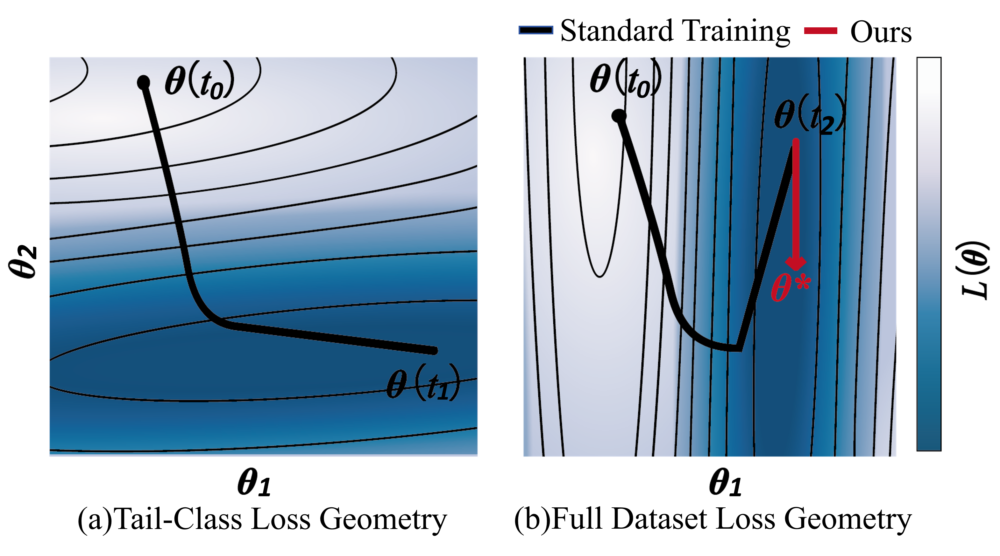
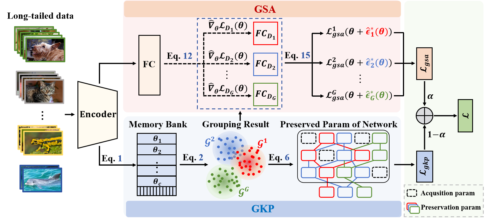
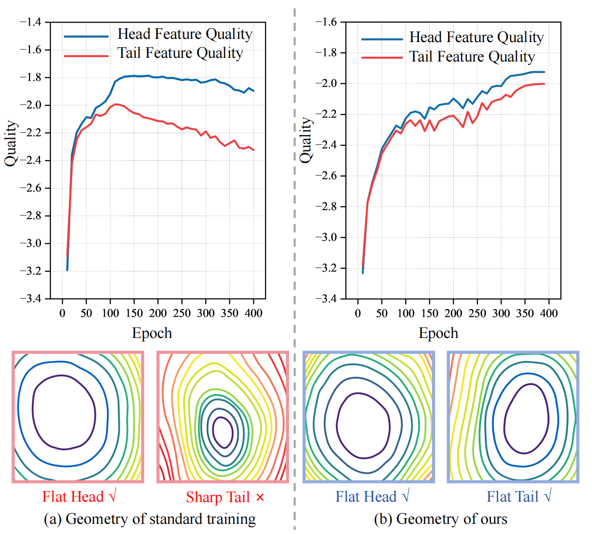
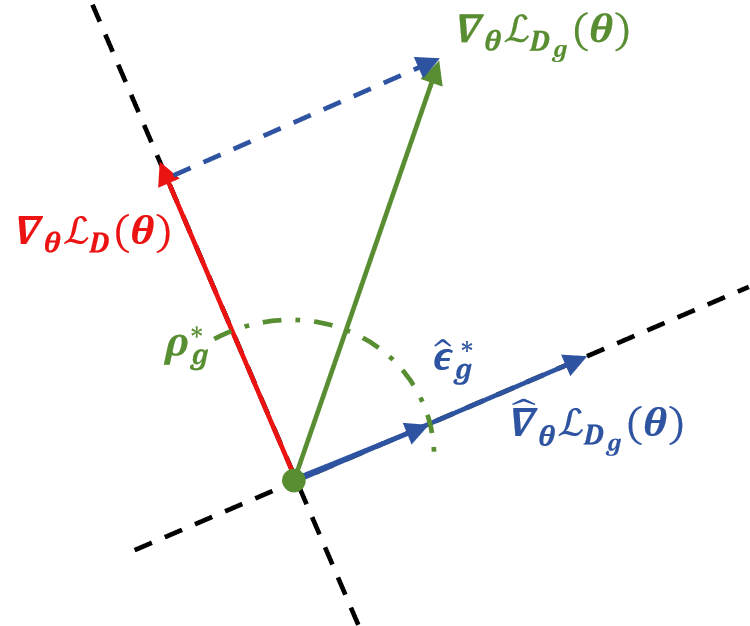
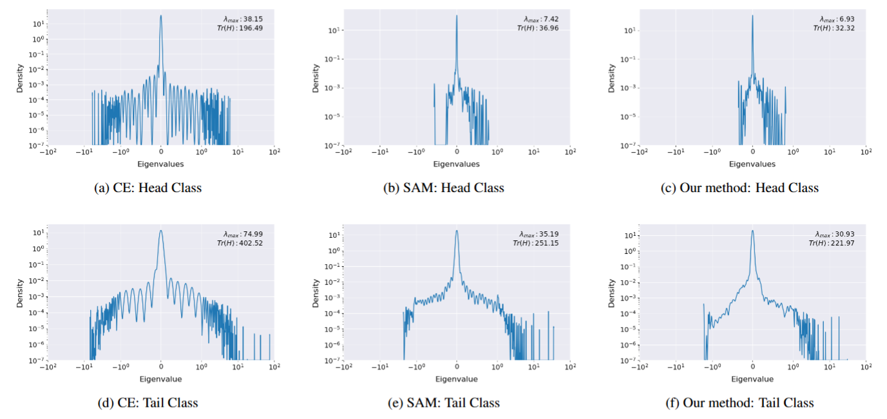

# Reframing Long-Tailed Learning via Loss Landscape Geometry

<p align="center">
  <a href="https://gkp-gsa.github.io/">Project Page</a> |
  <a href="https://arxiv.org/abs/2603.21217">arXiv</a> |
  <a href="static/pdfs/Paper.pdf">Paper</a> |
  <a href="static/pdfs/Supplement.pdf">Supplement</a>
</p>


<p align="center">
  <strong>Accepted by CVPR 2026</strong>
</p>


<p align="center">
  
</p>


This repository contains the official implementation of:

> **Reframing Long-Tailed Learning via Loss Landscape Geometry**  
> Shenghan Chen<sup>1,*</sup>, Yiming Liu<sup>2,*</sup>, Yanzhen Wang<sup>1</sup>, Yujia Wang<sup>1</sup>, Xiankai Lu<sup>1,✉</sup>  
> <sup>1</sup>Shandong University, <sup>2</sup>Zhejiang Sci-Tech University  
> <sup>*</sup>Equal Contribution, <sup>✉</sup>Corresponding Author

## Introduction

Long-tailed recognition remains challenging because models trained on imbalanced data often overfit to head classes while quickly forgetting or under-optimizing tail classes. We refer to this phenomenon as **tail performance degradation** and reinterpret it from the perspective of **loss landscape geometry**.

Our key observation is that different class groups may converge toward divergent regions in the loss landscape. When optimization is dominated by head classes, the model tends to settle into sharp and non-robust minima, which damages tail-class generalization. To address this issue, we propose a continual-learning-inspired framework that encourages the model to converge toward a shared and flatter solution.

The framework contains two core components:

- **Grouped Knowledge Preservation (GKP):** preserves group-specific convergence knowledge and prevents the degradation of parameters that are beneficial to other groups.
- **Grouped Sharpness Aware (GSA):** minimizes group-specific sharpness by removing the head-dominated global perturbation direction, guiding optimization toward flatter minima.

Our method requires neither external training samples nor pre-trained models, making it easy to apply to standard long-tailed recognition pipelines.

## Method Overview

<p align="center">
  
</p>


The proposed framework is designed to mitigate tail performance degradation from two complementary perspectives:

1. **Knowledge preservation across class groups.**  
   GKP memorizes group-specific convergence parameters and encourages the model to retain knowledge useful for different class groups.

2. **Geometry-aware optimization.**  
   GSA explicitly optimizes the geometry of the loss landscape by suppressing the head-dominated perturbation direction and emphasizing group-specific sharpness-aware updates.

Together, GKP and GSA help the model approach a flatter and more balanced solution, improving the trade-off between head, medium, and tail classes.

## Highlights

- A loss-landscape-geometry perspective for understanding long-tailed learning.
- A new interpretation of long-tailed difficulty as **tail performance degradation**.
- **Grouped Knowledge Preservation (GKP)** for group-wise parameter preservation.
- **Grouped Sharpness Aware (GSA)** for group-specific flat-minima optimization.
- No external data or pre-trained models required.
- Strong performance on standard long-tailed recognition benchmarks.

## Installation

```bash
git clone https://github.com/ChenShengHan100/gkp-gsa.git
cd gkp-gsa

conda create -n gkp-gsa python=3.9 -y
conda activate gkp-gsa

pip install -r requirements.txt
```

If the repository does not yet contain `requirements.txt`, a typical PyTorch-based environment can be created as follows:

```bash
conda create -n gkp-gsa python=3.9 -y
conda activate gkp-gsa

pip install torch torchvision torchaudio
pip install numpy scipy scikit-learn matplotlib tqdm pyyaml tensorboard
```

## Dataset Preparation

Please prepare the datasets under the path specified by `--data`. By default, the training commands below use `./data`.

A recommended directory structure is:

```text
data/
├── cifar-10-batches-py/
└── cifar-100-python/
```

For CIFAR-LT experiments, the long-tailed split is generated by the training pipeline according to the following arguments:

- `--dataset`: `cifar10` or `cifar100`
- `--imb_type`: imbalance type, e.g., `exp`
- `--imb_factor`: imbalance factor, e.g., `0.01` for imbalance ratio 100

If your code uses different dataset folder names, only the `--data` argument needs to be changed.

## Training

The following commands use the hyperparameters defined in the CIFAR-LT training parser.

### CIFAR-100-LT

```bash
python train.py \
  --dataset cifar100 \
  --data ./data \
  --arch resnet32_cifar_group \
  --imb_type exp \
  --imb_factor 0.01 \
  --workers 4 \
  --epochs 200 \
  --batch-size 256 \
  --lr 0.15 \
  --momentum 0.9 \
  --wd 5e-4 \
  --temp 0.1 \
  --warmup_epochs 5 \
  --schedule 160 180 \
  --alpha 2.0 \
  --beta 0.6 \
  --sam_rho 1 \
  --final_gamma_scale 1 \
  --adaptive_sam \
  --n_groups 1 \
  --finetune_start_epoch 200 \
  --gamma_groups 10 20 5 \
  --quality_lambda 1.0 \
  --min_rho 0.05 \
  --max_rho 0.8 \
  --rho_schedule none \
  --sigma 1.0 \
  --lmbda 0.9 \
  --rand_number 2131224 \
  --gpu 0 \
  --print-freq 100 \
  --root_log log_cifar100_gkp_gsa
```

### CIFAR-10-LT

```bash
python train.py \
  --dataset cifar10 \
  --data ./data \
  --arch resnet32_cifar_group \
  --imb_type exp \
  --imb_factor 0.01 \
  --workers 4 \
  --epochs 200 \
  --batch-size 256 \
  --lr 0.15 \
  --momentum 0.9 \
  --wd 5e-4 \
  --temp 0.1 \
  --warmup_epochs 5 \
  --schedule 160 180 \
  --alpha 2.0 \
  --beta 0.6 \
  --sam_rho 1 \
  --final_gamma_scale 1 \
  --adaptive_sam \
  --n_groups 1 \
  --finetune_start_epoch 200 \
  --gamma_groups 10 20 5 \
  --quality_lambda 1.0 \
  --min_rho 0.05 \
  --max_rho 0.8 \
  --rho_schedule none \
  --sigma 1.0 \
  --lmbda 0.9 \
  --rand_number 2131224 \
  --gpu 0 \
  --print-freq 100 \
  --root_log log_cifar10_gkp_gsa
```

### Resume Training

```bash
python train.py \
  --dataset cifar100 \
  --data ./data \
  --arch resnet32_cifar_group \
  --imb_type exp \
  --imb_factor 0.01 \
  --workers 4 \
  --epochs 200 \
  --batch-size 256 \
  --lr 0.15 \
  --momentum 0.9 \
  --wd 5e-4 \
  --temp 0.1 \
  --warmup_epochs 5 \
  --schedule 160 180 \
  --alpha 2.0 \
  --beta 0.6 \
  --sam_rho 1 \
  --final_gamma_scale 1 \
  --adaptive_sam \
  --n_groups 1 \
  --finetune_start_epoch 200 \
  --gamma_groups 10 20 5 \
  --quality_lambda 1.0 \
  --min_rho 0.05 \
  --max_rho 0.8 \
  --rho_schedule none \
  --sigma 1.0 \
  --lmbda 0.9 \
  --rand_number 2131224 \
  --resume path/to/checkpoint.pth.tar \
  --gpu 0 \
  --print-freq 100 \
  --root_log log_cifar100_gkp_gsa
```

> Note: `--adaptive_sam` is enabled by default in the current argument parser. It is still included in the command for clarity. If your actual training entry file is not named `train.py`, replace `train.py` with the correct script name.

## Main Arguments

| Argument          |        Default         | Description                                                  |
| :---------------- | :--------------------: | :----------------------------------------------------------- |
| `--dataset`       |       `cifar100`       | Dataset name. Use `cifar10` or `cifar100`.                   |
| `--data`          |        `./data`        | Dataset root path.                                           |
| `--arch`          | `resnet32_cifar_group` | Backbone architecture.                                       |
| `--imb_type`      |         `exp`          | Long-tailed imbalance type.                                  |
| `--imb_factor`    |         `0.01`         | Imbalance factor. `0.01` corresponds to imbalance ratio 100. |
| `--epochs`        |         `200`          | Total training epochs.                                       |
| `--batch-size`    |         `256`          | Batch size.                                                  |
| `--lr`            |         `0.15`         | Initial learning rate.                                       |
| `--schedule`      |       `160 180`        | Epochs for step learning-rate decay.                         |
| `--warmup_epochs` |          `5`           | Number of warm-up epochs.                                    |
| `--sam_rho`       |          `1`           | SAM perturbation radius.                                     |
| `--adaptive_sam`  |         `True`         | Whether to use adaptive SAM.                                 |
| `--gamma_groups`  |       `10 20 5`        | Group-wise gamma values.                                     |
| `--sigma`         |         `1.0`          | MkpSAM sigma value.                                          |
| `--lmbda`         |         `0.9`          | MkpSAM lambda value.                                         |
| `--root_log`      |      `log_bclSam`      | Root directory for training logs.                            |


## Results

### CIFAR-100-LT and CIFAR-10-LT

| Method                     | CIFAR100-LT r=100↑ | CIFAR100-LT r=50↑ | CIFAR100-LT r=10↑ | CIFAR10-LT r=100↑ | CIFAR10-LT r=50↑ | CIFAR10-LT r=10↑ |    Many↑ |    Med.↑ |     Few↑ |
| :------------------------- | -----------------: | ----------------: | ----------------: | ----------------: | ---------------: | ---------------: | -------: | -------: | -------: |
| CE (Baseline)              |               38.3 |              43.9 |              55.7 |              70.4 |             74.8 |             86.4 |     65.2 |     37.1 |      9.1 |
| Focal Loss (ICCV'17)       |               38.4 |              44.3 |              55.8 |              70.4 |             76.7 |             86.7 |     65.3 |     38.4 |      8.1 |
| LDAM-DRW (NeurIPS'19)      |               42.0 |              46.6 |              58.7 |              77.0 |             81.0 |             88.2 |     61.5 |     41.7 |     20.2 |
| cRT (ICLR'20)              |               42.3 |              46.8 |              58.1 |              75.7 |             80.4 |             88.3 |     64.0 |     44.8 |     18.1 |
| BBN (CVPR'20)              |               42.6 |              47.0 |              59.1 |              79.8 |             82.2 |             88.3 |        - |        - |        - |
| RIDE (3 experts) (ICLR'21) |               48.0 |                 - |                 - |                 - |                - |                - |     68.1 |     49.2 |     23.9 |
| CAM-BS (AAAI'21)           |               41.7 |              46.0 |                 - |              75.4 |             81.4 |                - |        - |        - |        - |
| DiVE (ICCV'21)             |               45.4 |              51.1 |              62.0 |                 - |                - |                - |        - |        - |        - |
| SAM (NeurIPS'22)           |               45.4 |                 - |                 - |              81.9 |                - |                - |     64.4 |     46.2 |     20.8 |
| BCL (CVPR'22)              |               51.9 |              56.6 |              64.9 |              84.3 |             87.2 |             91.1 |     67.2 |     53.1 |     32.9 |
| CUDA (ICLR'23)             |               47.6 |              51.1 |              58.4 |                 - |                - |                - |     67.3 |     50.4 |     21.4 |
| ADRW (NeurIPS'23)          |               46.4 |                 - |              61.9 |              83.6 |                - |             90.3 |        - |        - |        - |
| H2T (AAAI'24)              |               48.9 |              53.8 |                 - |                 - |                - |                - |        - |        - |        - |
| GBG (AAAI'24)              |               52.3 |              57.2 |                 - |              85.1 |             87.7 |                - |        - |        - |        - |
| DiffuLT (NeurIPS'24)       |               51.5 |              56.3 |              63.8 |              84.7 |             86.9 |             90.7 |     69.0 |     51.6 |     29.7 |
| DiffuLT + BBN (NeurIPS'24) |               51.9 |              56.7 |              64.0 |              85.0 |             87.2 |             90.9 | **69.5** |     51.9 |     30.2 |
| SEL (ICCV'25)              |               52.3 |              57.3 |              68.4 |              84.4 |             86.3 |             90.2 |        - |        - |        - |
| Heuristic-CALA (AAAI'25)   |               50.5 |                 - |              64.3 |              83.9 |                - |             91.7 |        - |        - |        - |
| Meta-CALA (AAAI'25)        |               52.3 |                 - |              65.5 |              84.7 |                - |             92.4 |        - |        - |        - |
| FeatRecon (ICLR'25)        |               52.5 |              57.0 |              65.3 |              85.2 |             87.8 |             91.6 |        - |        - |        - |
| LLM-AutoDA† (NeurIPS'24)   |               51.0 |              54.8 |                 - |                 - |                - |                - |     66.6 |     50.6 |     33.1 |
| **Ours**                   |           **53.2** |          **57.6** |          **68.7** |          **86.3** |         **88.2** |         **92.5** |     67.3 | **54.9** | **34.9** |

### ImageNet-LT and iNaturalist2018

| Method                                  | ImageNet-LT↑ | iNaturalist2018↑ |
| :-------------------------------------- | -----------: | ---------------: |
| CE (Baseline)                           |         41.6 |             61.0 |
| Focal Loss (ICCV'17)                    |            - |             61.1 |
| cRT (ICLR'20)                           |         47.3 |             65.2 |
| RIDE (3 experts) (ICLR'21)              |         54.9 |             72.7 |
| BCL (CVPR'22)                           |         56.0 |             71.8 |
| SAM (NeurIPS'22)                        |         53.1 |             70.1 |
| CUDA (ICLR'23)                          |         51.4 |             72.2 |
| ADRW (NeurIPS'23)                       |         54.1 |             70.7 |
| GBG (AAAI'24)                           |         57.6 |             71.9 |
| DiffuLT (NeurIPS'24)                    |         56.4 |                - |
| DiffuLT + RIDE (3 experts) (NeurIPS'24) |         56.9 |                - |
| SEL (ICCV'25)                           |         56.3 |             71.3 |
| Heuristic-CALA (AAAI'25)                |         54.1 |             73.2 |
| Meta-CALA (AAAI'25)                     |         55.1 |             74.0 |
| FeatRecon (ICLR'25)                     |         56.8 |             72.9 |
| LLM-AutoDA† (NeurIPS'24)                |         57.5 |             74.2 |
| **Ours**                                |     **57.9** |         **74.4** |

### Places-LT

| Method                        |    Many↑ |    Med.↑ |     Few↑ |     All↑ |
| :---------------------------- | -------: | -------: | -------: | -------: |
| CE (Baseline)                 |        - |        - |        - |     44.4 |
| Focal Loss (ICCV'17)          |     64.3 |     37.1 |      8.2 |     43.7 |
| τ-norm (ICLR'20)              |     59.1 |     46.9 |     30.7 |     49.4 |
| Balanced Softmax (NeurIPS'20) |     62.2 |     48.8 |     29.8 |     51.4 |
| Causal Model (NeurIPS'20)     |     62.7 |     48.8 |     31.6 |     51.8 |
| LWS (ICLR'20)                 |     60.2 |     47.2 |     30.3 |     49.9 |
| LADE (CVPR'21)                |     62.3 |     49.3 |     31.2 |     51.9 |
| DisAlign (CVPR'21)            |     62.7 |     52.1 |     31.4 |     53.4 |
| RIDE (2 experts) (ICLR'21)    |        - |        - |        - |     55.9 |
| BCL (CVPR'22)                 |        - |        - |        - |     56.7 |
| GBG (AAAI'24)                 |     69.6 |     55.8 |     38.1 |     58.7 |
| FeatRecon (ICLR'25)           |     67.9 |     54.7 |     37.8 |     57.5 |
| **Ours**                      | **69.7** | **56.0** | **38.6** | **58.9** |

## Visualization and Analysis

The project page presents the following visual analyses in order.

### Feature Quality and Geometry

<p align="center">
  
</p>


Our method flattens the loss landscape and preserves high feature quality for both head and tail classes.

### Gradient Decomposition

<p align="center">
  
</p>


The gradient decomposition analysis shows how the head-dominated global perturbation direction is removed to extract beneficial group-specific gradients.

### Eigenvalue Density

<p align="center">
  
</p>


The eigenvalue density distributions show that our method yields a flatter loss surface compared with standard CE training and SAM-style optimization.

## Repository Structure

A recommended repository structure is:

```text
gkp-gsa/
├── images/                  # Figures used in README and project page
│   ├── favicon.ico
│   ├── Figure1.png
│   ├── Figure2.png
│   ├── Figure3.png
│   ├── Figure4.png
│   └── Figure9.png
├── dataset/                 # Dataset loading and long-tailed split generation
│   ├── cifar.py
│   └── imagenet.py
├── models/                  # Backbone and classifier definitions
├── methods/                 # GKP, GSA, and optimization modules
├── utils/                   # Logging, metrics, and helper functions
├── train.py                 # Training entry
├── eval.py                  # Evaluation entry, if provided
├── requirements.txt
└── README.md
```

## Citation

If you find this project useful, please consider citing our paper:

```bibtex
@article{chen2026reframing,
  title={Reframing Long-Tailed Learning via Loss Landscape Geometry},
  author={Chen, Shenghan and Liu, Yiming and Wang, Yanzhen and Wang, Yujia and Lu, Xiankai},
  journal={arXiv preprint arXiv:2603.21217},
  year={2026}
}
```

## Acknowledgements

This project is built upon the long-tailed recognition literature and sharpness-aware optimization studies. We thank the authors of related open-source projects and benchmarks.

## License

This repository is released for academic research. Please check the final `LICENSE` file for detailed terms.